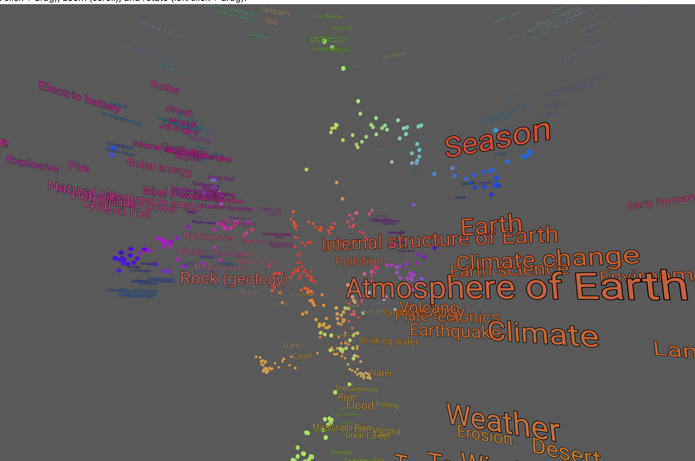

## 3D Wikipedia Embeddings Visualization

### Description
This React project visualizes Wikipedia articles in 3D space using embeddings. Each node represents an article, and the distance between nodes indicates the similarity of the articles. The project leverages libraries like `@react-three/fiber` and `@react-three/drei` for 3D rendering.

It displays a small graph of 1,000 articles by default, but users can load a larger graph of 10,000 articles. The 3D objects can be rotated using the "Start Rotation" button.

The small graph is the "[Level 3 Vital Articles](https://en.wikipedia.org/wiki/Wikipedia:Vital_articles)" from Wikipedia, and the large graph is the "[Level 4 Vital Articles](https://en.wikipedia.org/wiki/Wikipedia:Vital_articles/Level/4)". 

The Vital Articles are a collection of the most important articles on Wikipedia, and they are organized into 6 levels based on their importance, with a greater number of articles at each level. 

### Features
- 3D visualization of Wikipedia article embeddings
- Rotation and color-based visualization
- Dynamic loading of different graph sizes (small and large)
- Orbit controls for pan, zoom, and rotate
- Centroid and normalization factor for better visual presentation

#### Demo
#### 1000 Vital Articles


#### 10,000 Vital Articles


#### Close up Screenshot

### Installation

```bash
npm install
```

### Usage

Run the development server:

```bash
npm start
```

### How It Works
- On initial load, a small graph (`1k.json`) is fetched and rendered.
- Users can choose to load a larger graph (`10k.json`) using the "Load Large Graph" button.
- Click "Start Rotation" to rotate the 3D objects.

### Embeddings Preprocessing and 3D Layout
Before visualizing the Wikipedia articles in 3D, their embeddings are preprocessed using UMAP (Uniform Manifold Approximation and Projection). UMAP is a machine learning algorithm that's effective for dimensionality reduction, transforming high-dimensional embeddings into 3D coordinates for rendering.

#### Steps to Generate 3D Layout
- Download Wikipedia dump, and filter articles based on the Vital Articles list.

- Generate high-dimensional embeddings for each Wikipedia articles using `all-MiniLM-L6-v2`
- Each article is split into 400 word chunks, and the embeddings for each chunk are averaged to get the final embedding for the article.
- Reduce the high-dimensional embeddings to 3D coordinates using UMAP.
- Store the preprocessed data including 3D coordinates and other parameters in JSON files for rendering.
- Normalize and center the 3D coordinates based on the centroid for proper visualization.
- Assign colors to nodes based on their 3D coordinates for easier differentiation.

### Dependencies
- `React`
- `@react-three/fiber`
- `@react-three/drei`
- `three.js`

### Core Components

#### `DocumentNode`
This is a functional component that represents a node (Wikipedia article) in 3D space.

#### `MeshProvider`
This component provides context for the mesh references and group references used for rotation.

#### `MenuBar`
It includes buttons for loading small and large graphs, as well as toggling rotation. It also has a popup for additional project information.

#### `useRotation`
Custom hook for rotating the group of 3D objects.

### File Structure
- `index.tsx` : Entry point
- `DocumentVisualization.tsx` : Main component for the 3D visualization
- `utils.js` : Utility functions like `rgbToHsl`

### API Endpoints
- `data/10k.json`: Contains large graph data
- `data/1k.json`: Contains small graph data
### Contributions
Feel free to submit PRs or open an issue.

### License
MIT

### Author
[Brian Sunter](https://briansunter.com)